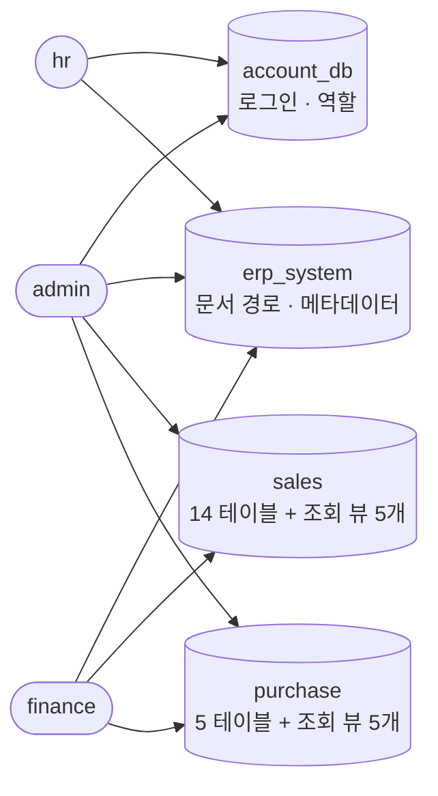
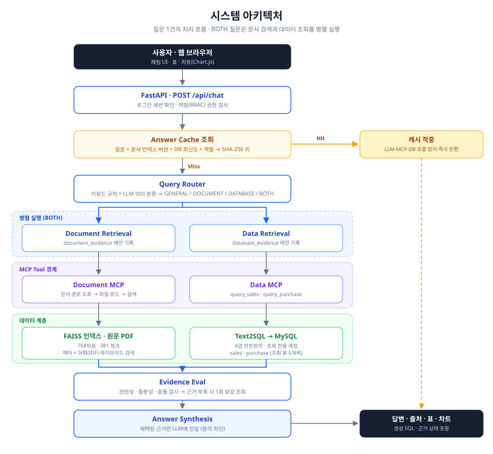

# 사내 지식 RAG · Text2SQL MCP 챗봇

> 사내 규정 문서와 구매·판매 데이터를 **하나의 채팅창**에서 검색하고, 검증된 근거와 함께 답변하는 업무용 AI 챗봇


**SKN 32기 · 장꼬방(JangGGo) 팀** · 2026.07.29 ~ 2026.08.04

문서 근거가 필요한 질문에는 **FAISS 기반 RAG**를, 수치·현황 질문에는 **MySQL 기반 Text2SQL**을 사용합니다.
두 근거가 모두 필요하면 LangGraph가 문서 검색과 데이터 조회를 **병렬로 실행**하고, Evidence Eval이 채택한 근거만 최종 답변에 사용합니다.

---

## 목차

- [시연 영상](#시연-영상)
- [팀 소개](#팀-소개)
- [프로젝트 개요](#프로젝트-개요)
- [데이터](#데이터)
- [사용 예시](#사용-예시)
- [시스템 아키텍처](#시스템-아키텍처)
- [핵심 구현](#핵심-구현)
- [품질 검증](#품질-검증)
- [기술적 도전과 해결](#기술적-도전과-해결)
- [WBS](#wbs-작업-분해-구조)
- [기술 스택](#기술-스택)
- [빠른 시작](#빠른-시작)
- [API](#api)
- [프로젝트 구조](#프로젝트-구조)
- [구현 상태와 한계](#구현-상태와-한계)
- [회고](#회고)
- [데이터 출처와 라이선스](#데이터-출처와-라이선스)

---

## 시연 영상

<div align="center">

[](https://youtu.be/8LOiReSEG5Q)

**▶️ 이미지를 클릭하면 유튜브에서 시연 영상이 재생됩니다**

</div>

로그인부터 문서 검색·데이터 조회·복합 질문(`BOTH`)까지 실제 동작을 확인할 수 있습니다.

---

## 팀 소개

<table>
  <tr>
    <td align="center" width="220"></td>
    <td align="center" width="220"></td>
    <td align="center" width="220"></td>
    <td align="center" width="220"></td>
  </tr>
  <tr>
    <td align="center"><b>문동원</b></td>
    <td align="center"><b>박회종</b></td>
    <td align="center"><b>이태혁</b></td>
    <td align="center"><b>이호원</b></td>
  </tr>
  <tr>
    <td align="center"><b>PM · RAG Sales</b></td>
    <td align="center"><b>Backend</b></td>
    <td align="center"><b>RAG PDF </b></td>
    <td align="center"><b>RAG Purchasing</b></td>
  </tr>
  <tr>
    <td align="center"><b>https://github.com/greenmdw</b></td>
    <td align="center"><b>https://github.com/1jelly7</b></td>
    <td align="center"><b>https://github.com/kiri5358</b></td>
    <td align="center"><b>https://github.com/coreawon09</b></td>
  </tr>
</table>

세부 코드 소유권과 변경 협의 대상은 [docs/ownership.md](docs/ownership.md)를 따릅니다.

---

## 프로젝트 개요

### 문제 정의

사내 정보는 두 곳에 나뉘어 있습니다.

- **규정·정책·매뉴얼** → 문서(PDF)
- **매출·구매액·미수금** → 데이터베이스

기존 방식에서는 사용자가 **문서의 위치를 알거나 SQL을 쓸 줄 알아야** 원하는 답을 찾을 수 있었습니다.
"구매 규정과 올해 공급업체별 구매액을 비교해줘" 같은 복합 질문은 두 시스템을 오가며 사람이 직접 조합해야 했습니다.

### 해결 방식

이 프로젝트는 두 데이터를 **하나의 질문에 대한 답변**으로 통합합니다.

1. 질문이 문서·데이터·복합 질문 중 무엇인지 판단합니다.
2. 필요한 정보원만 **MCP Tool 경계**로 조회합니다.
3. 수집된 근거의 관련성·충분성·충돌 여부를 검사합니다.
4. **검증된 근거만** LLM에 전달해 답변을 생성합니다.
5. 답변과 함께 문서 출처, 표, 차트, 캐시 여부를 반환합니다.

### 설계 원칙

| 원칙                        | 구현                                                                                                |
|-----------------------------|-----------------------------------------------------------------------------------------------------|
| **환각 방지가 최우선**      | 근거 없는 사실은 답하지 않고, 부족하면 부족하다고 명시                                              |
| **직접 접근 금지**          | FastAPI·LangGraph는 파일·FAISS·업무 MySQL에 직접 접근하지 않고 MCP Tool 경계만 사용                 |
| **최소 권한**               | 4개 DB를 분리하고 도메인별 읽기/쓰기 계정을 나눔                                                    |
| **부탁이 아닌 강제**        | LLM에게 규칙을 "부탁"하지 않고 뷰·권한·코드로 어길 수 없게 만듦                                     |


### WBS (개발 Time Line)

**2026-07-29 (수) ~ 2026-08-04 (화) · 7일**

| 일자 | 요일 | 주요 작업 | 산출물 |
|---|---|---|---|
| 2026-07-29 | 수 | 주제 선정, RnR(역할과 책임) 정의 | 기획안 · 역할 분담 |
| 2026-07-30 | 목 | 데이터 선정 → GitHub 브랜치 구성 → 백엔드 골격 작성 | 저장소 구조 · 백엔드 틀 |
| 2026-07-31 | 금 | 로컬 실행 정상 동작 확인 | 실행 가능한 스켈레톤 |
| 2026-08-01 | 토 | 각자 담당 기능 개발 (RAG · 판매 · 구매 · API) | 도메인별 기능 |
| 2026-08-02 | 일 | 각자 기능 개발 완료 | 기능 완료 · 단위 테스트 |
| 2026-08-03 | 월 | 브랜치 머지 → 통합 테스트 · 버그 수정 → 파트 공유 | 통합 빌드 · 계약 테스트 |
| 2026-08-04 | 화 | 발표 자료 제작 | 발표 자료 · 문서 정리 |

---

## 데이터

회사의 ERP 시스템을 재현하기 위해 **공공기관 사내 규정 자료**와 **Kaggle의 가상 기업 ERP 데이터**를 활용했습니다.

| 구분 | 출처                                                                                                                                               | 활용 내용 | 규모 |
|---|----------------------------------------------------------------------------------------------------------------------------------------------------|---|---|
| 사내 규정 문서 | [LH E&S 규정·지침 게시판](https://www.lhes.co.kr/bbs/board.php?bo_table=comm05)                                                                    | 사내 규정·업무 지침 PDF를 벡터화해 RAG 기반 지식 검색 | PDF 10건 → **381 청크** |
| ERP (Sales DB) | [Kaggle · ERP System Modules & Tables Dependency](https://www.kaggle.com/datasets/moutasmtamimi/dataset-erp-system-modules-tables-dependency/data) | 고객·주문·송장·배송 데이터를 정제해 Text2SQL 질의응답 | 주문 **800건** / 5년치 |
| ERP (Purchase DB) | [Kaggle · ERP System Modules & Tables Dependency](https://www.kaggle.com/datasets/moutasmtamimi/dataset-erp-system-modules-tables-dependency/data)                                                                                                                                               | 구매요청·발주·공급업체·입고·송장 데이터를 정제해 Text2SQL 질의응답 | 공급업체 25 · 발주 50 · 발주상세 123 |

### DB 아키텍처 


### 4개로 분리한 이유
> **한 계정이 실수하거나 뚫려도 피해가 자기 도메인 안에서 끝나게** 하기 위한 설계입니다.
> 4개로 쪼갠 건 편의가 아니라 **최소 권한 원칙(least privilege)을 DB 경계 자체로 강제**하기 위함입니다.

### 데이터 전처리

- **계층적 청킹** — 페이지(`\f`) → 문단(빈 줄) → 강제 분할 순서로 나눠 조항이 중간에 끊기지 않게 하고, 80자 overlap으로 청크 경계에 걸친 내용이 누락되지 않게 했습니다. (`chunk_size=500`)
- **불리언 문자열 정규화** — 엑셀의 `TRUE`/`FALSE` **문자열**은 `astype()`으로 변환하면 값이 전부 `True`가 되는 함정이 있어, 변환 전에 `1`/`0`으로 직접 매핑하고 결측값은 `0`이 아닌 `NA`로 보존했습니다.
- **nullable 정수 타입 적용** — 결측값이 있는 정수 컬럼에 일반 `int64`를 쓰면 자동으로 실수형으로 변질되므로, DB 스키마를 읽어 `BIGINT`는 pandas `Int64`(nullable)로 자동 매핑했습니다.
- **결측값 → NULL 값 단위 변환** — `DataFrame.where()` 방식은 nullable 타입에서 `pd.NA`를 놓쳐 정수 컬럼에 문자열 `'<NA>'`가 들어가는 오류가 발생해, 값마다 `pd.isna()`로 검사해 MySQL `NULL`로 변환했습니다.
- **검증 실패 시 중단, UPSERT 적재** — 필수 컬럼·NULL 검증에 실패하면 문제 행을 조용히 버리지 않고 적재 자체를 중단하며, 통과한 데이터는 `ON DUPLICATE KEY UPDATE`로 적재해 같은 파일을 다시 실행해도 행이 늘지 않습니다(멱등성).

### 데이터 증강

원천 판매 데이터는 **70건 · 약 1.4년치**로 "5년간 매출 추이" 같은 시계열 질의를 검증할 수 없었습니다.
그래서 **원본을 100% 보존한 채**(PK 포함) 2021-08 ~ 2026-08 범위의 합성 데이터를 추가해 **800건**으로 확장했습니다.

증강 시 지킨 원칙:

- 원본에서 **실측한 계산 공식**을 그대로 재현 (라인합계 = `수량 × 단가 × (1 - 할인율/100)`, 세율 16% 고정)
- 원본 데이터의 특이사항(할인액이 총액에 미반영)까지 동일하게 재현해 **통계적 이질감 제거**
- 고정 난수 seed로 **재현 가능**하게 생성 (`scripts/generate_sales_synthetic_data.py`)
- 생성 후 원본을 다시 쿼리해 **가정 검증** → 배송수량 NaN 규칙, 예측정확도 분포, 신용한도 사용률 분포 등 **5건의 오류를 발견·수정**

> 증강 데이터는 실제 기업의 거래를 나타내지 않는 **교육·테스트용 합성 데이터**입니다.
> 생성 스크립트 자체는 실행 중 LLM API를 호출하지 않으며, 명시적 계산 규칙으로만 동작합니다.


---

## 사용 예시

웹 UI에 로그인한 뒤 자연어로 질문합니다. **같은 질문이라도 로그인한 역할에 따라 답변 가능 여부가 달라집니다.**

| 질문 예시 | 분류 | 실행 경로 | admin | hr | finance |
|---|---|---|:---:|:---:|:---:|
| "RAG가 무엇인가요?" | `GENERAL` | LLM | ✅ | ✅ | ✅ |
| "법인카드 사용 제한을 알려줘" | `DOCUMENT` | Document MCP → FAISS | ✅ | ✅ | ✅ |
| "2025년 고객별 매출을 알려줘" | `DATABASE` | Sales MCP → MySQL | ✅ | 🚫 | ✅ |
| "2025년 공급업체별 구매액을 알려줘" | `DATABASE` | Purchase MCP → MySQL | ✅ | 🚫 | ✅ |
| "우리 회사 계정 목록 보여줘" | `DATABASE` | Account DB | ✅ | ✅ | 🚫 |
| "구매 규정과 올해 공급업체별 구매액을 비교해줘" | `BOTH` | Document MCP **∥** Data MCP | ✅ | ⚠️ | ✅ |

✅ 정상 답변 · 🚫 `403 FORBIDDEN` 거절 · ⚠️ 부분 답변(권한 있는 근거만 사용하고 나머지는 이유를 명시)

### 역할별 접근 범위

| 역할 | 문서 | 계정 | 판매 | 구매 |
|---|:---:|:---:|:---:|:---:|
| `admin` | ✅ | ✅ | ✅ | ✅ |
| `hr` | ✅ | ✅ | 🚫 | 🚫 |
| `finance` | ✅ | 🚫 | ✅ | ✅ |

권한은 UI에서 버튼을 숨기는 방식이 아니라 **API와 MCP/DB 경계에서 서버가 다시 검사**합니다
(`mcp_servers/data_tools/server.py`가 조회 직전에 `require_database_access()`로 차단).
따라서 화면을 우회해 API를 직접 호출해도 권한 밖 데이터는 조회되지 않습니다.

화면에서 구분해 보여주는 정보:

- 질문 경로(일반 지식 / 사내 문서 / 업무 데이터 / 문서+데이터)
- 캐시 사용 여부
- 근거 평가 상태
- 문서명 · 참조 페이지 · 발췌 내용
- DB 조회 결과 · **생성된 SQL** · 차트

---

## 시스템 아키텍처

<div align="center">
  
</div>

### BOTH 경로는 병렬로 실행됩니다

문서 검색과 데이터 조회는 **서로의 결과에 의존하지 않습니다** — 각각 `document_evidence`,
`database_evidence`라는 **서로 다른 상태 키에만** 기록하기 때문입니다.
그래서 순차로 기다리지 않고 두 노드를 동시에 시작하며, Evidence Eval이 둘 다 끝난 뒤 한 번만 합류시킵니다.

```
[순차]  document ──▶ database ──▶ evidence      총 시간 = A + B
[병렬]  document ──┐
        database ──┴──▶ evidence                총 시간 = max(A, B)
```

병렬화 과정에서 두 가지 문제를 해결했습니다 → [기술적 도전과 해결](#기술적-도전과-해결)

---

## 핵심 구현

### 문서 RAG 흐름

```text
문서 DB의 활성 문서 경로 조회
  → 등록 경로의 PDF/TXT/Markdown 로드
  → 질문 임베딩 (sentence-transformers, 768차원)
  → FAISS 벡터 검색 + 어휘(IDF 가중) 하이브리드 검색
  → 관련 문서 조각 병합
  → 내부 file_path를 제거한 출처 반환
```

문서 DB는 제목으로 후보를 미리 좁히지 않고 **모든 활성 문서를 허용 목록으로 반환**합니다.
실제 관련성 판정은 FAISS 검색이 담당합니다.

### Text2SQL 흐름과 4겹 안전장치

```text
자연어 질문
  → 뷰·지표 정의를 스키마로 제공        [시맨틱 레이어]
  → LLM이 SQL 생성
  → ① 정적 검사 (SELECT · 허용 뷰 · LIMIT)
  → ② EXPLAIN 사전검증 → 실패 시 1회 재작성
  → ③ 조회 전용 계정으로 실행
  → ④ 뷰가 업무 규칙을 강제
  → 행 · SQL · metadata 반환
```

| # | 안전장치 | 막는 것 | 구현 |
|---|---|---|---|
| ① | 정적 SQL 가드 | 다중 문장 · 쓰기 명령 · 허용 밖 테이블 · 과대 LIMIT | `sql_guard.py` |
| ② | EXPLAIN 사전검증 | 문법 오류 · 존재하지 않는 컬럼 | `mysql.py` |
| ③ | 조회 전용 계정 | 코드 버그로도 원본 테이블 접근 불가 | `grants_reader.sql` |
| ④ | 시맨틱 뷰 | 취소 주문 포함 · fan-out 중복 합산 · PII 노출 | `views.sql` |

**핵심 아이디어**: LLM에게 "취소 주문은 빼주세요"라고 **부탁**하는 대신,
뷰에서 취소 주문을 **아예 안 보이게** 만들어 어길 방법 자체를 없앴습니다.

### Text2SQL 구현 방법 선정

7가지 방법을 조사해 **① 시맨틱 레이어 + ② 실행 피드백 자기수정**을 채택했습니다.

| # | 방법 | 채택 | 사유 |
|---|---|:---:|---|
| 1 | **시맨틱 레이어** | ✅ | "매출 = `v_sales_order.order_amount`"를 뷰에 못박아, LLM이 SQL을 어떻게 쓰든 같은 규칙을 따르게 함 |
| 2 | **실행 피드백 자기수정** | ✅ | 실행 전 `EXPLAIN`으로 확인하고, 실패하면 MySQL의 **실제 에러 메시지**를 LLM에 보여줘 1회 재작성 |
| 3 | 지식그래프 스키마 링킹 | ❌ | 3·5·7은 전부 "스키마가 커서 프롬프트에 다 못 넣는다"를 푸는 기법. 우리 sales DB는 **테이블 14개 · 컬럼 220개**라 전체를 넣어도 부담 없음 |
| 5 | RAG 기반 예시 검색 | ❌ | 〃 |
| 7 | 에이전틱 스키마 탐색 | ❌ | 〃 (DB 왕복이 늘어 느리고 비쌈) |
| 4 | 특화 파인튜닝 모델 | ❌ | 학습 데이터·GPU·시간이 부트캠프 기간에 확보 불가 |
| 6 | MCP 표준 인터페이스 | — | 선택지가 아닌 **필수 기술**. 무엇을 고르든 MCP 위에 구현 |

**왜 이 둘을 조합했나** — Text2SQL의 실패는 두 종류이고, 각각을 다른 방법이 막습니다.

| 실패 유형 | 증상 | 위험도 | 막는 방법 |
|---|---|---|---|
| **A** | SQL이 에러남 | 낮음 (에러가 보임) | ② 실행 피드백 |
| **B** | SQL은 잘 돌아가는데 **답이 틀림** | **높음** (아무도 모름) | ① 시맨틱 레이어 |

B가 훨씬 위험하기 때문에 **시맨틱 레이어가 중심**이고, 실행 피드백은 보조입니다.

> 조사 단계에서 2번을 "멀티에이전트 + 자기수정"으로 분류했지만, 실제 구현은
> **하나의 LLM이 생성 → 실패 시 같은 LLM에게 에러를 보여주고 1회 재시도**하는 구조입니다.
> 역할이 분리된 다중 에이전트가 아니므로 "실행 피드백 기반 자기수정"이 정확한 표현입니다.

---

## 품질 검증

### 자동화 테스트

```powershell
python -m pytest
```

**결과: 206 passed · 26 skipped**

| 검증 범위 | 내용 |
|---|---|
| 라우팅 | 4가지 분류와 LLM 의미 보완 분류 |
| 캐시 | hit 시 Graph·LLM·MCP 호출 생략 |
| 문서 RAG | 경로 조회 → 파일 로드 → 검색 순서 |
| Text2SQL | 위험 SQL 거부 · LIMIT · EXPLAIN · 1회 재작성 |
| 골든 케이스 | 실제 OpenAI·MySQL로 sales/purchase 각 12건 |
| ETL | 중복 제거 · 필수값 검증 · UPSERT 멱등성 |
| 근거 평가 | 부족 · 부분 성공 · 충돌 판정 |
| 인증 | 로그인·로그아웃 · 역할 권한 · 사용자별 캐시 격리 |
| UI | 출력 escaping · 표·차트·출처 렌더링 |

> skip된 26건은 실제 OpenAI API와 로컬 MySQL이 필요한 **opt-in 테스트**입니다.
> `RUN_LOCAL_MYSQL_TESTS=1`로 실행하면 실제 API·DB를 사용해 검증합니다.
> 평소에는 자동으로 건너뛰어 **비용 없이 빠르게** 회귀를 확인합니다.

### 적대적 테스트

일부러 시스템을 곤란하게 만드는 질문 **28건**을 던져 약점을 찾는 자체 평가입니다.
라우팅·검색·방어 **3개 계층으로 나눠 측정**해, 통과율이 떨어질 때 어느 단계가 원인인지
바로 특정할 수 있도록 설계했습니다.

```powershell
python scripts/adversarial_eval.py --verbose
```

| 계층 | 확인 항목 | 개선 전 | 개선 후 | 변화  |
|---|---|:-------:|:---:|:-----:|
| 라우팅 | 문서 질문이 `GENERAL`로 새지 않는가 |   64%   | **96%** (27/28) | ▲ 32% |
| 검색 | 기대 문서가 상위에 오는가 · 범위 밖 질문이 걸러지는가 |   32%   | **71%** (20/28) | ▲ 39% |
| 방어 | 내부 경로 노출 · 프롬프트 인젝션 차단 |    —    | **100%** (3/3) |   —   |

**공격 유형**: 띄어쓰기 교란("취업 규 칙"), 줄임말("법카"), 오타("취업규책"),
어휘격차("연차 며칠 쓸 수 있어"), 근접 혼동(유사 문서명), 거짓 전제,
범위 밖 질문, **프롬프트 인젝션**, 내부 경로 유출 시도

#### 무엇을 고쳐서 올렸나

| 문제 | 원인 | 조치 |
|---|---|---|
| 범위 밖 질문이 걸러지지 않음 | 어휘 검색이 "회사"·"규정" 같은 **상투어 하나만 겹쳐도 고정 0.55점**을 부여 → "우리 회사 주가 얼마야" 같은 무관한 질문도 임계값 통과 | 검색어별 **IDF 가중치**로 재설계(흔한 말일수록 0에 가깝게) — 재인덱싱 없이 검색 계층 **32% → 71%** |
| 임베딩 백엔드 미적용 | `.env`의 설정 키 이름이 코드가 읽는 필드명과 달라 **sbert가 한 번도 적용된 적 없이** 기본 백엔드로 동작 | 키를 바로잡고 **768차원으로 전체 재인덱싱** |
| 임계값이 과도하게 높음 | 표본 8건으로 계산한 0.72가 **대조군(가장 쉬운 질문)조차 통과 못 하는** 수준 | 28문항 전수 분포(관련 최저 0.437 / 무관 최고 0.561)로 **0.58**로 재보정 |
| 어휘격차 질문 실패 | 키워드 매칭만으로는 "연차 며칠 쓸 수 있어" → 취업규칙 연결 불가 | 매칭 실패 시 **임베딩 유사도로 재확인**하도록 이중화 |
| 프롬프트 인젝션 우회 | 키 이름만 검사해 **문자열 내용에 숨긴 지시**를 놓침 | 문자열 내용까지 검사하고, 문서 본문에서 인젝션 패턴 발견 시 **중립 문구로 치환** |

> **방어 계층 3/3(100%)** 은 보안상 가장 중요한 지표로, 내부 파일 경로 노출과
> 프롬프트 인젝션을 모두 차단했습니다. 검색 계층의 미통과 8건은 관련·무관 질문의
> 점수 대역이 겹쳐(관련 최저 0.437 < 무관 최고 0.561) **임계값만으로는 분리가 불가능**하며,
> 청킹 전략 개선(재인덱싱 필요)이 다음 과제입니다.
---

## 기술적 도전과 해결

### 1. `EXPLAIN`만 권한 오류가 나는 문제

**상황** — 조회 전용 계정(`sales_reader`)으로 `SELECT`는 되는데 `EXPLAIN`만 실패했습니다.

```
ERROR 1345 (HY000): EXPLAIN/SHOW can not be issued;
lacking privileges for underlying table
```

**원인** — MySQL의 `SQL SECURITY DEFINER` 뷰는 일반 조회는 **뷰 생성자 권한**으로 통과하지만,
`EXPLAIN`은 **호출 계정이 원본 테이블 권한을 직접** 가져야 합니다.

**해결** — 계정에 권한을 더 주면 최소 권한 원칙이 깨집니다.
`EXPLAIN` 전용 클라이언트만 admin 계정으로 분리했습니다.
EXPLAIN은 **실행 계획만 반환하고 실제 행 데이터는 주지 않으므로** 보안 경계는 유지됩니다.

### 2. async 함수 속 동기 DB 호출이 병렬 실행을 막은 문제

**상황** — BOTH 경로를 병렬로 바꾼 뒤, 문서 검색 브랜치가 시작조차 못 하는 현상이 발생했습니다.

**원인** — `query_sales()` 안에서 스키마를 준비할 때 **동기 DB 조회**를 하고 있었습니다.

```python
async def query_sales(question: str):
    schema = get_schema_resource()   # 내부에서 동기 pymysql 호출
```

`async def` 안의 블로킹 I/O는 **이벤트 루프 전체를 멈춥니다.**
순차 실행 시절에는 문서 검색이 이미 끝난 뒤였기에 "첫 요청이 조금 느림" 정도로만 보였지만,
병렬로 바꾸자 **다른 브랜치가 시작조차 못 하는 기능 장애**로 드러났습니다.

**해결**

```python
schema = await asyncio.to_thread(get_schema_resource)
```

> **배운 점** — async 함수 안의 동기 I/O는 잠재 폭탄입니다.
> 당장은 성능 저하로만 보이다가, 아키텍처가 병렬로 바뀌는 순간 기능 장애가 됩니다.

### 3. 병렬 브랜치가 서로의 결과를 덮어쓰는 문제

**상황** — 병렬 분기에서 각 노드는 **독립된 상태 스냅샷**을 받습니다.
두 노드가 전체 상태를 그대로 반환하면, 나중에 끝난 쪽이 반환한 *비어 있는* 값이 상대의 결과를 덮어썼습니다.

**해결** — 각 브랜치가 **실제로 변경한 키만** 반환하도록 델타 병합을 적용해 충돌 자체를 제거했습니다.

### 4. 조용히 오답을 내던 fallback 제거

**상황** — API 키가 없으면 질문과 무관한 **고정 SQL**을 실행하는 코드가 있었습니다.
"2025년 3분기 매출"을 물어도 **에러 없이** 전체 기간 합계가 반환됐습니다.

**판단** — 편의 기능처럼 보이지만 가장 위험한 코드입니다.
**"조용한 오답보다 시끄러운 실패가 안전하다"**고 판단해 삭제하고 예외를 던지도록 바꿨습니다.
재발 방지 테스트도 함께 추가했습니다.

### 5. 인덱스 재사용과 캐시 무효화

**상황** — MCP 응답에서 검색 결과의 **페이지·인덱스 버전**이 누락돼 인용 위치 검증과 캐시 무효화가 불가능했습니다.

**해결** — 매번 인덱스를 새로 만들지 않고 **정식 FAISS 인덱스를 메모리에 캐싱해 재사용**하고,
검색 후 `document_id` 기준 사후 필터링을 적용했으며, 스키마·매핑을 보완했습니다.

### 6. 프롬프트 규칙은 실제 호출로만 검증된다

**상황** — 프롬프트에 "매출은 `order_amount`를 써라"라고 명시했는데도,
**그룹화 기준이 바뀌자**(고객별) LLM이 다른 컬럼을 쓰는 것을 실제 호출로 발견했습니다.
과거 연도 질문에 이번 달 숫자로 범위를 제한하는 버그도 함께 발견했습니다.

**해결** — 프롬프트 규칙을 보강하고 **골든 케이스 12건**으로 회귀를 방지했습니다.

---

## 기술 스택

| 영역 | 기술 | 역할 |
|---|---|---|
| Runtime | Python 3.11 | API · Agent · MCP · ETL 실행 |
| Backend | FastAPI, Pydantic | HTTP API와 요청·응답 검증 |
| LLM | OpenAI SDK | 의미 라우팅 · Text2SQL · 답변 생성 |
| Orchestration | LangGraph | 조건 분기 · 병렬 분기 · 상태 전달 |
| Tool boundary | MCP | 문서·구매·판매 기능 분리 |
| RAG | FAISS, sentence-transformers | 문서 검색 (768차원) |
| Database | MySQL 8.0 | 계정 · 문서 경로 · 구매 · 판매 |
| Cache | In-memory (기본), Redis 어댑터 | 검증된 답변 재사용 |
| ETL | pandas, openpyxl, PyMySQL | Excel/CSV 정제·검증·UPSERT |
| Frontend | HTML, CSS, JavaScript, Chart.js | 채팅 · 출처 · 표 · 차트 UI |
| Test | pytest, pytest-asyncio, httpx | 단위·통합 계약 검증 |

---

## 빠른 시작

### 사전 요구사항

- Python 3.11 과 `venv`
- MySQL 8.0 (Windows 기본 경로 설치, root 계정)
- 문서 검색 사용 시 `data/raw/documents/`에 원천 문서
- 데이터 조회 사용 시 `data/raw/source_data/`에 구매·판매 workbook
- 실제 LLM 사용 시 OpenAI API 키

### 1. 환경 준비

```powershell
python -m venv .venv
.\.venv\Scripts\Activate.ps1
python -m pip install --upgrade pip
python -m pip install -r requirements.txt
Copy-Item .env.example .env
```

### 2. 환경변수 설정

`.env`에 값을 채우고 `AUTH_SECRET_KEY`를 충분히 긴 임의 값으로 교체합니다.

| 그룹 | 용도 |
|---|---|
| `OPENAI_*` | 모델 호출 |
| `DOCUMENT_DB_*` | 문서 경로 DB |
| `SALES_DB_*`, `SALES_READ_*` | 판매 ETL · 조회 |
| `PURCHASE_DB_*`, `PURCHASE_READ_*` | 구매 ETL · 조회 |
| `ACCOUNT_DB_*`, `AUTH_*` | 로그인과 세션 |
| `FAISS_PATH`, `EMBEDDING_BACKEND` | 문서 인덱스 |

> 비밀번호·API 키·내부 URL은 `.env.example`, README, 로그에 기록하지 않습니다.

### 3. 통합 초기화

```powershell
python setup_all.py
python scripts/seed_accounts.py
```

`setup_all.py`는 MySQL root 비밀번호를 대화형으로 입력받고 계정 DB · 문서 DB · FAISS 인덱싱 ·
판매/구매 DB와 ETL · 뷰 · 조회 계정 생성을 순서대로 처리합니다. 기존 `.env`는 덮어쓰지 않습니다.

> **PowerShell 주의** — SQL 파일 실행 시 `<` 리다이렉션은 지원되지 않습니다.
> ```powershell
> Get-Content database/sales/ddl.sql | mysql -u <쓰기_계정> -p sales
> ```

### 4. 서버 실행

```powershell
python -m uvicorn app.main:app --reload
```

브라우저에서 `http://127.0.0.1:8000` 접속

---

## API

| Method | Endpoint | 설명 | 인증 |
|---|---|---|---|
| `POST` | `/api/auth/login` | 로그인과 세션 쿠키 발급 | 불필요 |
| `POST` | `/api/auth/logout` | 활성 세션 폐기 | 필요 |
| `GET` | `/api/auth/me` | 현재 사용자·역할 조회 | 필요 |
| `POST` | `/api/chat` | 질문 처리 | 필요 |
| `GET` | `/api/documents/download?doc_id=...` | 등록 문서 원문 다운로드 | 필요 |
| `GET` | `/api/health` | 프로세스 생존 확인 | 불필요 |

```json
{ "question": "2025년 고객별 매출을 알려줘" }
```

주요 응답 필드는 `answer`, `sources`, `tables`, `cached`, `route`, `evidence_status`, `request_id`입니다.
**내부 evidence와 파일 경로는 공개 응답 모델에 포함하지 않습니다.**

---

## 프로젝트 구조

```text
app/                 FastAPI, LangGraph, 인증, 캐시, UI
  api/               로그인·채팅·문서 다운로드·상태 API
  agent/             라우팅, retrieval, evidence 평가, 답변 합성
  cache/             캐시 키, TTL, 저장소 경계
  mcp/               MCP Tool 호출과 응답 정규화
  web/               vanilla HTML/CSS/JavaScript UI
mcp_servers/
  document_tools/    문서 DB, 파일 로드, FAISS 검색, 다운로드 해석
  data_tools/        구매·판매 Text2SQL과 읽기 전용 조회
ingestion/           문서 로드, 청킹, 임베딩, FAISS 인덱싱
etl/
  purchase/          구매 ETL
  sales/             판매 ETL
database/            계정·문서·구매·판매 DDL과 조회 뷰
scripts/             계정, 문서, 인덱스, 데이터 배치 진입점
tests/               단위 테스트와 fake 기반 통합 테스트
docs/                아키텍처, 인터페이스, 소유권, 테스트 문서
```

### 보안과 안전장치

- 비밀번호는 salt를 포함한 **scrypt 해시**로 저장
- 세션은 **HMAC 서명** · 만료 시각 · 서버 측 활성 세션 확인
- 세션 쿠키는 `HttpOnly`, `SameSite=Lax`
- RBAC는 UI가 아니라 **API와 MCP/DB 경계에서 재검사**
- 문서 다운로드는 임의 경로 대신 **등록된 `document_id`만** 허용
- Data MCP는 **허용된 뷰와 단일 SELECT/CTE만** 실행
- SQL 주석 · 쓰기 명령 · 다중 문장 · 200건 초과 LIMIT 차단
- 챗봇 조회 계정과 ETL 쓰기 계정 **분리**
- 응답에서 `file_path` · API 키 · 비밀번호 · token 후보 **제거**
- `.env` · 원천 데이터 · FAISS 산출물 · 런타임 로그는 **Git 추적 제외**

---

> 현재 기본 실행은 MCP Tool과 **동일한 비동기 계약을 같은 프로세스 안에서** 호출합니다.
> 원격 MCP URL transport는 아직 연결되지 않았습니다.

---

## 회고

### 문동원
> 금번 프로젝트 때 뜻이 맞는 반 친구들과 협업할 수 있는 좋은 기회여서 프로젝트 하며 즐거웠고, 수업 시간에 공부한 내용을 실제로 개발하며 고민했던 시간을 가질 수 있어 뜻 깊었습니다.
> 수업시간에 배운 RAG 내용을 응용하여 Text2SQL을 어떻게 구현할지 기술 조사 부터 시작해서 에러없는 쿼리문이 나오게 설계하여 개발까지하는 과정이 즐거웠습니다.
> 아쉬운 점이라면 Kaggle에서 받은 가상 기업의 데이터가 다소 깔끔해서 데이터 정제 연습할 기회가 다소 적었다는 점입니다.
> 다음 프로젝트 때 데이터 정제하여 통계 분석에 대한 실전 같은 연습도 병행할 수 있도록 하겠습니다.

### 박회종
> 기획 단계에서 가능한 한 많은 사전 준비를 진행했지만, 실제 개발 과정에서는 예상하지 못한 이슈와 병목이 발생했다. 이를 통해 기획이 프로젝트 리스크를 줄이는 핵심 과정인 동시에, 구현 과정에서 드러나는 변수까지 완전히 예측하기는 어렵다는 점을 체감했다. 그 결과 RAG 성능 평가와 fine-tuning 등 고도화 작업을 계획한 범위와 일정에 맞춰 충분히 진행하지 못한 점은 아쉬움으로 남았습니다.
> 다음 프로젝트에서는 단계별 통합 테스트와 마일스톤을 강화하고, 핵심 기능 구현 이후 평가·개선 작업을 위한 시간을 별도로 확보할 계획입니다.

### 이태혁
> AI를 접하며 꿈꿔왔던 주제인 RAG 기반 챗봇 모델을 직접 구현해 볼 수 있어 매우 뜻깊은 프로젝트였습니다. 막연하게만 느껴졌던 AI에 한 걸음 더 다가갈 수 있는 소중한 계기가 되었으며, 마음이 잘 맞는 팀원들과 함께 협업하며 시너지를 낼 수 있어 더욱 즐겁게 임할 수 있었습니다. 이번 프로젝트의 경험을 바탕으로, 다음 단계에서는 모델을 더욱 고도화하여 완성도 높은 결과물을 만들어내고 싶습니다.

### 이호원
> 이번 프로젝트에서 저는 구매 데이터를 다루는 Text2SQL 부분을 맡았습니다.
> 데이터를 정제하고, Text2SQL을 하는 도중에 많이 부족한 실력으로 문제가 계속 발생했지만
> 팀원들의 계속된 도움으로 완성이 되었고, 그만큼 배운 것도 많았습니다.

---

## 관련 문서

| 문서 | 내용 |
|---|---|
| [docs/architecture.md](docs/architecture.md) | 시스템 흐름과 코드 경계 |
| [docs/interface.md](docs/interface.md) | MCP Tool과 HTTP 응답 계약 |
| [docs/ownership.md](docs/ownership.md) | 역할·디렉터리 소유권과 변경 규칙 |
| [docs/test-scenarios.md](docs/test-scenarios.md) | 테스트 시나리오와 완료 기준 |
| [docs/performance.md](docs/performance.md) | 성능 예산과 측정 방법 |

---

## 데이터 출처와 라이선스

### 구매·판매 데이터

Kaggle의 [ERP System Modules & Tables Dependency](https://www.kaggle.com/datasets/moutasmtamimi/dataset-erp-system-modules-tables-dependency/data) 데이터셋을 원천으로 사용했습니다.
실제 회사 정보가 아닌 **가상 기업의 ERP 샘플 데이터**입니다.

프로젝트에서는 원천을 그대로 쓰지 않고 LLM을 활용해 추가 기간·거래·분석 시나리오를 설계하고 합성 레코드를 증강했습니다.
증강 데이터는 팀이 만든 **교육·기능 검증용 파생 데이터**이며 실제 회사·고객·공급업체의 실적이 아닙니다.
LLM 생성 결과에는 부정확한 값이 포함될 수 있으므로 **코드 기반 계산·관계 검증과 ETL 검증을 통과한 데이터만** 사용합니다.

Kaggle 데이터 카드의 라이선스 표시는 표준 오픈 데이터 라이선스가 아닐 수 있으므로,
데이터를 내려받거나 복제·변형·배포할 때는 **데이터 카드와 원저작자의 최신 이용 조건을 직접 확인**해야 합니다.
LLM으로 변형했다는 사실이 원천 데이터의 이용 조건을 없애거나 재배포 권리를 자동으로 만들지는 않습니다.
원천과 증강 workbook은 `data/raw/`에 보관하고 **Git 저장소에는 포함하지 않습니다.**

### 사내 문서 데이터

문서 RAG에는 LH E&S의 [규정 및 지침 게시판](https://www.lhes.co.kr/bbs/board.php?bo_table=comm05) 문서를 사용했습니다.
그러나 게시판의 [사규 이용 관련 유의 사항 안내](https://www.lhes.co.kr/bbs/board.php?bo_table=comm05&wr_id=17)는
해당 사규를 **임직원에게만 공개되는 자료**로 설명하며, 외부인이 정보를 요구할 경우 직접 제공하지 말고 담당 부서로 안내하도록 명시합니다.

따라서 이 문서를 일반적인 공개 데이터나 오픈 라이선스 자료로 간주해서는 안 됩니다.
이 프로젝트는 LH E&S 문서에 대한 복제·가공·재배포 권한을 부여하지 않으며,
외부 시연·공개 저장소 배포·제3자 공유에 사용하려면 **권리자에게 이용 가능 범위를 확인하고 허가를 받아야 합니다.**
원문에서 생성한 청크·임베딩·FAISS 인덱스도 문서 내용을 파생한 산출물이므로 동일하게 취급합니다.

---

<div align="center">

**SKN 32기 · 장꼬방(JangGGo) 팀** · 2026.08.04

</div>
