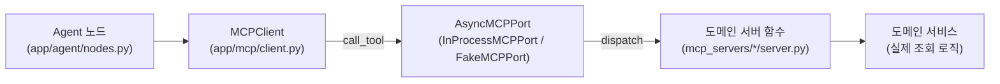

# [팀 공유 자료 8] 새 MCP 도구 추가 표준 패턴

- **목적**: Jira 연동 등 새 도메인을 붙이기 전에, "MCP 도구 하나를 추가하려면 정확히
  어떤 파일들을 건드려야 하는가"를 한 곳에 정리한다. 지금은 이게 각 담당자 머릿속에만
  있어서, 새 도메인을 넣을 때마다 무엇을 빠뜨렸는지 코드 리뷰로만 걸러지고 있었다.
- **범위**: 현재 in-process 구성(purchase, sales, document) 기준. 진짜 원격 MCP
  프로토콜(별도 프로세스로 뜨는 MCP 서버) 전환은 8절에서 별도로 다룬다.

---

## 1. 지금 구조를 한 장으로



핵심은 **`MCPClient`는 세 가지 Tool 이름(`search_documents`, `query_purchase`,
`query_sales`)만 알고, 그 안의 실제 로직은 전혀 모른다**는 것이다. Tool 이름과 envelope
스키마(`app/schemas/mcp.py`)가 Agent 쪽과 도메인 쪽을 잇는 유일한 계약이다. 새 도메인을
추가한다는 건 이 계약을 지키는 새 Tool 이름 하나를 이 그림의 오른쪽 절반에 끼워 넣는
일이다.

지금은 `Port`가 항상 `InProcessMCPPort`라서 오른쪽 절반이 같은 프로세스 안에서
`import`로 바로 호출된다(2절 참고). 별도 프로세스로 뜨는 진짜 MCP 서버가 되더라도, 왼쪽
절반(Agent, MCPClient, 계약)은 전혀 안 바뀌는 게 이 구조의 의도다.

---

## 2. 지금 실제로 쓰는 경로: `InProcessMCPPort`

`app/mcp/client.py`의 `InProcessMCPPort.call_tool()`이 `tool_name`을 보고 도메인
모듈을 **그 자리에서 import**해서 호출한다(파일 상단이 아니라 함수 안에서 import하는
이유: FastAPI 기동 시점에 문서 저장소나 MySQL을 건드리지 않기 위해서다).

```python
async def call_tool(self, tool_name, payload):
    if tool_name in ("query_purchase", "query_sales"):
        from mcp_servers.data_tools.server import execute_data_tool
        return await execute_data_tool(...)
    if tool_name == "search_documents":
        ...
    raise ValueError(f"지원하지 않는 MCP Tool입니다: {tool_name}")
```

새 도메인을 추가하면 **반드시 이 함수에 `elif` 분기를 하나 추가**해야 한다 - 여기에 안
넣으면 나머지를 다 만들어도 "지원하지 않는 MCP Tool입니다" 예외로 끝난다.

---

## 3. 현재 코드에 이미 두 가지 패턴이 섞여 있다 (중요)

새 도메인을 만들 때 어느 쪽을 따라야 하는지 헷갈릴 수 있어서 먼저 짚는다.

| | **data_tools (purchase/sales) - 권장** | **document_tools - 비권장, 기존 부채** |
|---|---|---|
| envelope 조립 로직 | `mcp_servers/data_tools/server.py`의 `execute_data_tool()` **한 곳**에만 존재 | `app/mcp/client.py`의 `InProcessMCPPort.call_tool()` 안에 **그대로 복붙**되어 있고, `mcp_servers/document_tools/server.py`의 `create_server()`에도 **거의 같은 로직이 또 있음** |
| `InProcessMCPPort`가 하는 일 | `execute_data_tool(tool_name, ...)`을 그냥 호출 | envelope 구성 로직 전체를 자기 안에서 재구현 |
| 로직이 바뀌면 | 한 곳만 고치면 됨 | 두 곳을 항상 같이 고쳐야 하는데, 강제하는 장치가 없음 |

**data_tools 쪽이 맞는 패턴이다.** 도메인 서비스 → envelope 변환 로직은 도메인 쪽에
`execute_<domain>_tool()` 같은 이름으로 한 번만 만들고, `InProcessMCPPort`는 그걸
호출만 해야 한다. `document_tools`는 지금 부채 상태로 남아있는 것이니, **새 도메인을
만들 때 이 패턴을 그대로 베끼면 안 된다.** (document_tools 자체를 data_tools 패턴으로
정리하는 것도 다음 후보로 남겨둔다 - 지금 당장 급한 건 아니지만 둘이 계속 따로
움직이면 언젠가 조용히 어긋난다.)

---

## 4. 새 도메인 추가 체크리스트 (예: Jira)

아래 순서대로 하면 빠뜨리는 항목이 최소화된다. 파일 경로는 실제 존재하는 경로 기준.

### 4-1. 도메인 서비스 작성
`mcp_servers/jira_tools/query.py` (또는 적절한 이름) - 실제 Jira API/DB 호출과
비즈니스 로직. 내부 evidence 형태를 정의한다 (purchase/sales의 `{"type": "database",
"domain": ..., "rows": ..., "generated_sql": ..., "metadata": ...}`처럼, Jira라면
`{"type": "jira", "domain": "jira", "issues": [...], "metadata": {...}}` 식).

### 4-2. 서버 dispatch 함수 작성 (data_tools 패턴을 따를 것 - 3절 참고)
`mcp_servers/jira_tools/server.py`에 `execute_jira_tool(tool_name, ..., user_context)`
함수를 만든다. 성공/실패를 표준 envelope(`status`, `domain`, `message`, `data`,
`sources`, `metadata`)로 변환하는 로직은 **여기 한 곳에만** 둔다.

### 4-3. 스키마에 새 Tool 등록
`app/schemas/mcp.py`:
```python
ToolName = Literal["search_documents", "resolve_document_download",
                    "query_purchase", "query_sales", "query_jira"]  # 추가
MCPDomain = Literal["document", "purchase", "sales", "jira", "both"]  # 추가
```
여기 안 넣으면 `ToolSuccessEnvelope`/`ToolErrorEnvelope` 검증에서 계속 막힌다.

### 4-4. `InProcessMCPPort`에 dispatch 분기 추가
`app/mcp/client.py`의 `call_tool()`에 (data_tools처럼 얇게):
```python
if tool_name == "query_jira":
    from mcp_servers.jira_tools.server import execute_jira_tool
    return await execute_jira_tool(tool_name, str(payload.get("question", "")), payload.get("user_context"))
```

### 4-5. `MCPClient`에 사용자용 메서드 추가
같은 파일, `purchase_query`/`sales_query`를 그대로 본떠서:
```python
async def jira_query(self, question: str, user_context=None) -> list[dict[str, Any]]:
    envelope = await self._call_success("query_jira", payload, "jira")
    return _database_evidence("jira", envelope)  # 또는 jira 전용 정규화 함수
```

### 4-6. 권한 정책 등록 (DB/외부 서비스 접근이 필요하면)
`app/auth/policy.py`:
```python
SERVICE_DATABASES = frozenset({"document_db", "account_db", "sales_db", "purchase_db", "jira_db"})
ROLE_DATABASES = {
    "admin": SERVICE_DATABASES,
    "hr": frozenset({"document_db", "account_db", "jira_db"}),  # 필요한 role에만 추가
    ...
}
```
안 넣으면 `require_database_access`가 항상 `PermissionError`를 던진다 (기본이
차단이라 안전하긴 하지만, 아무도 못 씀).

### 4-7. Agent 라우팅에 편입
- `app/agent/state.py`: 새 도메인이 기존 DATABASE 라우팅과 별개 카테고리라면
  `DataDomain` Literal 확장 또는 별도 route 값 검토
- `app/agent/nodes.py`: 도메인 판별 로직(지금 `sales_terms`/`purchase_terms`
  키워드 매칭)에 Jira 관련 키워드 추가, evidence 수집 분기 추가
- `app/agent/semantic_router.py`: 라우팅용 anchor 질문 세트에 Jira 예시 추가 검토
  (`SIMILARITY_THRESHOLD`는 sbert 전환 후 0.45 그대로인데, 이것도 재보정
  후보라는 점은 04번 문서·07번 문서 참고)

### 4-8. Evidence 정책
`app/agent/evidence_eval.py`의 `_meets_policy`가 쓰는 임계값
(`min_document_score`/`min_relevance`)에 Jira용 별도 기준이 필요한지 검토. 지금은
document 타입만 `min_document_score`, 나머지는 전부 `min_relevance` 하나를
공유한다 - Jira 이슈 검색도 지금처럼 "일반 DB 근거"로 취급할지, 문서처럼 유사도
점수 기반으로 취급할지 미리 정해야 한다.

### 4-9. 테스트
- `tests/unit/test_data_mcp.py`류를 본떠 `FakeMCPPort`로 `MCPClient.jira_query()`
  정규화·오류 분류 단위 테스트
- **`tests/unit/test_import_smoke.py`가 자동으로 새 모듈을 잡아준다** - `mcp_servers/`
  아래 새 파일을 만들기만 하면 스캔 대상에 자동 포함된다(1번 작업 참고). 별도로
  등록할 필요 없음, import만 깨지지 않으면 통과.
- 검색/판단 로직이 들어간다면 `scripts/adversarial_eval.py`에 케이스 추가 검토
  (2번 작업에서 만든 오탐/재현율 진단 패턴 참고)

---

## 5. 자주 놓치는 지점

- **`ToolName`/`MCPDomain` Literal 갱신 누락**: pydantic이 조용히 막아서 에러
  메시지가 "domain이 일치하지 않습니다" 같은 식으로 나오는데, 원인은 스키마
  갱신 누락인 경우가 많다.
- **`InProcessMCPPort.call_tool()`에 분기 추가 누락**: `ValueError: 지원하지
  않는 MCP Tool입니다`로 바로 드러나서 상대적으로 찾기 쉽다.
- **envelope 조립 로직을 `client.py`에 직접 쓰는 것** (document_tools처럼) -
  3절 참고, data_tools 패턴을 따를 것.
- **권한 정책 등록 누락**: 에러가 아니라 "항상 빈 결과"로만 보여서 디버깅이
  제일 오래 걸리는 케이스다. 새 도메인 연동 후 첫 실패는 이것부터 의심할 것.

---

## 6. 지금 구조의 한계 (알고 넘어가야 할 것)

`InProcessMCPPort`는 이름 그대로 **같은 프로세스 안에서 직접 함수 호출**을 하는
전환기용 구현이다. 진짜 MCP 프로토콜(stdio/HTTP로 별도 프로세스와 통신)이 아니다.
`mcp_servers/*/server.py`의 `create_server()`가 만드는 `MCPServer` 객체는 이미 진짜
MCP 스펙으로 도구를 등록하고 있어서, 나중에 원격 전환할 준비 자체는 되어 있다 -
`InProcessMCPPort`를 실제 MCP client transport(stdio/HTTP)로 교체하기만 하면 되는
구조를 의도한 것으로 보인다. 다만:

- 지금은 `AsyncMCPPort` 구현체가 `InProcessMCPPort`와 테스트용 `FakeMCPPort` 둘뿐이라
  실제 원격 전환은 검증된 적 없음
- Jira처럼 **외부 서비스**를 붙이는 경우, in-process로 그대로 붙이면 외부 API 지연이
  Agent 프로세스를 직접 블로킹한다 - purchase/sales/document는 전부 내부 DB/파일이라
  이 문제가 지금까지 드러나지 않았을 뿐이다. Jira 연동이 첫 "진짜 외부 I/O" 사례가
  될 가능성이 높으니, 붙일 때 timeout(`MCPClient(timeout_seconds=...)`)과 재시도
  전략을 처음부터 신경 써야 한다.
- 원격 MCP 프로토콜 연결 자체는 인수인계 문서에도 "범위 밖으로 명시"되어 있던
  항목이라, 이번 정리에서는 실제 전환은 하지 않고 위 체크리스트까지만 표준화한다.
