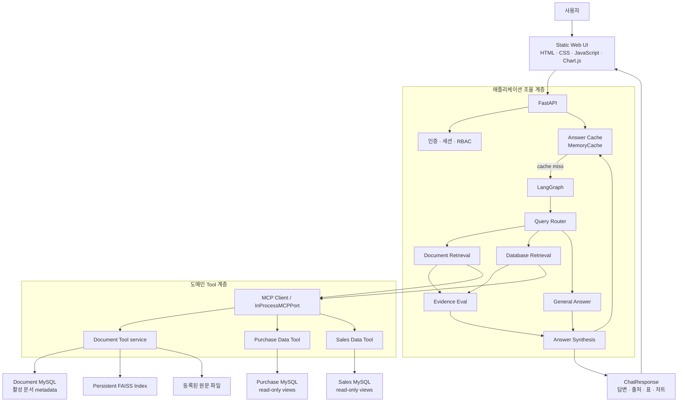
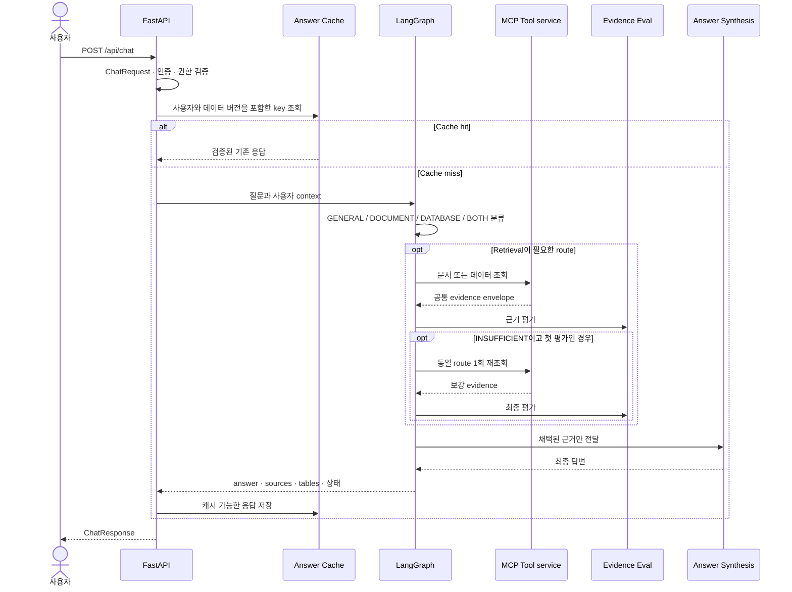
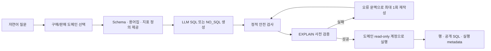
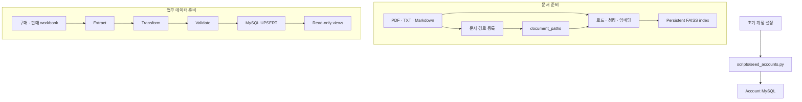

# 시스템 아키텍처

## 1. 문서 목적

이 문서는 사내 지식 RAG·Text2SQL MCP 챗봇의 전체 시스템 구조와 주요 컴포넌트의
책임, 온라인 요청 및 오프라인 데이터 준비 흐름을 설명한다. 프로젝트 소개와 실행 방법은
[README.md](README.md), 코드 경계의 상세 설계는
[docs/architecture.md](docs/architecture.md)를 기준으로 하며, 이 문서는 두 내용을 시스템
관점에서 통합해 요약한다.

## 2. 시스템 개요

이 시스템은 규정·정책·매뉴얼과 같은 비정형 사내 문서와 구매·판매 실적 같은 정형 업무
데이터를 하나의 채팅 API로 조회한다. 질문의 성격에 따라 다음 처리 경로 중 하나를 선택한다.

| 질문 유형 | 주요 처리 경로 | 답변 근거 |
|---|---|---|
| `GENERAL` | LLM 답변 생성 | 일반 모델 지식 |
| `DOCUMENT` | Document Tool → FAISS 검색 | 문서 조각, 문서 ID, 제목, 페이지 |
| `DATABASE` | Purchase/Sales Tool → Text2SQL → MySQL | 실행 SQL과 조회 행 |
| `BOTH` | Document Tool → Data Tool 순차 실행 | 분리 보존된 문서 및 데이터 근거 |

FastAPI는 인증, 권한, 캐시와 LangGraph 실행을 조율한다. LangGraph는 질문 라우팅,
근거 검색, 근거 평가와 답변 합성을 담당한다. 문서 및 데이터 조회는 MCP Client 경계를
통해 각 Tool service에 위임한다.

## 3. 아키텍처 원칙

### 3.1 조율 계층과 데이터 접근 계층의 분리

FastAPI와 Agent는 원문 파일, FAISS 인덱스, 업무 MySQL에 직접 접근하지 않는다.
문서 검색은 Document Tool service가, 구매·판매 조회는 각 Data Tool service가 수행한다.
이를 통해 API 및 Agent 로직이 저장 기술과 도메인별 조회 구현에 직접 결합되는 것을 막는다.

현재 기본 MCP transport는 `InProcessMCPPort`다. 즉, Tool service가 MCP Tool과 동일한
비동기 계약을 제공하지만 같은 Python 프로세스 안에서 호출된다. 환경 변수의
`DOCUMENT_MCP_URL`, `DATA_MCP_URL`을 사용하는 원격 MCP transport는 아직 연결되지
않았다.

### 3.2 온라인 질의와 오프라인 준비 작업의 분리

채팅 요청은 이미 준비된 문서 인덱스와 읽기 전용 DB View만 조회한다. 문서 등록·인덱싱과
구매·판매 ETL은 별도 배치로 수행하며, API/Agent 요청 경로에서 인덱스를 재생성하거나
ETL을 실행하지 않는다.

### 3.3 검증된 근거만 사용하는 답변 생성

검색 결과는 곧바로 답변 생성에 사용되지 않는다. Evidence Eval이 관련성, 신뢰도, 필수
metadata, freshness와 명시적 충돌 여부를 평가한 뒤 채택된 근거만 Answer Synthesis에
전달한다. 근거가 부족하면 동일 retrieval 경로를 최대 한 번 더 실행하고, 그래도 부족하면
추측 대신 안전한 부족 안내를 반환한다.

### 3.4 최소 권한과 비밀정보 비노출

역할 기반 접근 제어는 UI가 아닌 서버와 Tool 경계에서 적용한다. Data Tool은 허용된
읽기 전용 View에 대한 단일 `SELECT`/`WITH`만 실행하며, 챗봇 조회 계정과 ETL 쓰기
계정을 분리한다. 내부 `file_path`, API key, 비밀번호와 token 계열 값은 공개 응답에서
제거한다.

## 4. 전체 구성



`BOTH` 경로는 Document와 Database retrieval을 병렬 실행하지 않고 `document → database`
순서로 실행한다. 두 도메인의 근거는 섞지 않고 분리해 보존하며, 한쪽 조회가 실패해도
다른 쪽에 유효한 근거가 있으면 `PARTIALLY_SUPPORTED` 응답을 만들 수 있다.

## 5. 주요 컴포넌트와 책임

| 계층 | 주요 위치 | 책임 |
|---|---|---|
| 웹 UI | `app/web/` | 로그인, 채팅 입력, 출처·표·차트 렌더링 |
| HTTP API | `app/api/`, `app/main.py` | 요청 검증, 인증 사용자 확인, Graph 호출, 공개 응답 구성 |
| 인증 및 권한 | `app/auth/` | 계정 검증, 서명 세션, 활성 세션 확인, 역할별 접근 정책 |
| Agent | `app/agent/` | 라우팅, retrieval, 근거 평가, 재조회, 답변 합성 |
| 캐시 | `app/cache/` | 사용자·권한·데이터 버전을 반영한 키 생성, TTL 관리 |
| MCP Client 경계 | `app/mcp/` | Tool 호출과 공통 응답 envelope 정규화 |
| Document Tool | `mcp_servers/document_tools/` | 활성 문서 확인, FAISS/어휘 검색, 다운로드 대상 해석 |
| Data Tool | `mcp_servers/data_tools/` | 구매·판매 dispatch, Text2SQL, SQL 검증, 읽기 전용 실행 |
| 문서 인덱싱 | `ingestion/` | 원문 로드, 청킹, 임베딩, FAISS 인덱스 생성 |
| 업무 ETL | `etl/purchase/`, `etl/sales/` | 원천 workbook 추출·변환·검증·UPSERT |
| DB 및 View 정의 | `database/` | 계정·문서·구매·판매 스키마와 조회 View 정의 |
| 배치 진입점 | `scripts/` | 계정 시딩, 문서 등록·인덱싱, 통합 초기화 보조 |

## 6. 온라인 요청 흐름

### 6.1 인증과 공통 처리

1. 사용자가 `POST /api/auth/login`으로 로그인한다.
2. 서버는 활성 계정과 scrypt 비밀번호 해시를 검증한다.
3. 성공하면 HMAC 서명된 `chatbot_session` 쿠키를 `HttpOnly`, `SameSite=Lax`로
   발급하고 서버 측 `SessionStore`에 활성 세션을 등록한다.
4. `/api/chat`, `/api/auth/me`, `/api/auth/logout`, 문서 다운로드 요청은 유효한 쿠키와
   활성 서버 세션을 모두 요구한다.
5. HTTP middleware는 요청별 `request_id`, `X-Request-ID`, `Server-Timing`을 만들고
   비밀정보를 제외한 완료 로그를 기록한다.

역할별 허용 데이터 영역은 다음과 같다.

| 역할 | 허용 DB |
|---|---|
| `admin` | `account_db`, `document_db`, `purchase_db`, `sales_db` |
| `hr` | `account_db`, `document_db` |
| `finance` | `document_db`, `purchase_db`, `sales_db` |

### 6.2 채팅 요청



라우터는 명시적인 업무 키워드를 우선 사용한다. 키워드만으로 분류되지 않는 일부 질문은
임베딩 앵커 유사도로 `DOCUMENT` 또는 `DATABASE` 경로를 보강 판정한다.

## 7. 문서 RAG 아키텍처

### 7.1 오프라인 문서 준비

```text
data/raw/documents/
  -> scripts/register_documents.py
  -> MySQL document_paths에 활성 문서 ID와 경로 metadata 등록
  -> scripts/ingest_documents.py 또는 scripts/rebuild_faiss_index.py
  -> data/faiss/index.faiss + metadata.json
```

인덱스에는 문서 청크 본문과 공개 가능한 출처 metadata가 저장된다. 원문 문서와 FAISS
산출물은 런타임 데이터이므로 Git에 커밋하지 않는다.

### 7.2 질의 시 문서 검색

1. Document Tool이 문서 DB에서 모든 활성 문서의 ID, 제목, 내부 경로와 갱신 시각을
   허용 목록으로 조회한다.
2. 프로세스에서 재사용하는 영구 FAISS 인덱스로 벡터 검색을 수행한다.
3. 벡터 검색과 어휘 검색 결과를 합치고 활성 문서 ID에 속한 청크만 남긴다.
4. 최고 점수가 기준보다 낮으면 Agent가 동의어 확장 질의를 한 번 추가할 수 있다.
5. 사용자에게는 문서 ID, 제목, 페이지, 발췌문, 인덱스 버전만 반환하고 내부 경로는
   제거한다.

질문마다 원문을 다시 읽거나 임시 인덱스를 생성하지 않는다. 원문 파일 접근은 등록 및
인덱싱, 선택적 시작 warm-up, 권한이 검증된 다운로드 경계에서만 일어난다.

### 7.3 원문 다운로드

출처 카드의 다운로드 URL은 `GET /api/documents/download?doc_id=...` 형식이다. 서버는
클라이언트가 입력한 파일 경로가 아니라 등록된 활성 문서 ID를 내부 경로로 해석한다.
따라서 임의 경로 접근과 내부 파일 경로 노출을 방지한다. 현재 이 기능은 Host의 in-process
경계이며 독립 원격 Document MCP Tool로 등록돼 있지 않다.

## 8. 구매·판매 Text2SQL 아키텍처



정적 검사에서는 단일 `SELECT`/`WITH`, 도메인별 허용 View, 금지 키워드와
`LIMIT <= 200`을 확인한다. `INSERT`, `UPDATE`, `DELETE`, DDL, SQL 주석과 다중 문장을
차단한다. 구매와 판매는 서로 다른 View 허용 목록과 DB 계정을 사용한다. 결과가 없거나
해당 스키마로 답할 수 없으면 `NO_RESULT`를 반환하며 Graph는 이를 빈 근거로 평가한다.

구매·판매 원천은 AdventureWorks2022 Excel 자료를 바탕으로 하며 교육·테스트용 합성
데이터가 추가돼 있다. 데이터 증강과 ETL은 오프라인 준비 과정이며 채팅 요청 중에는
실행되지 않는다.

## 9. 근거 평가와 응답 구성

Evidence Eval은 새 사실을 만들지 않고 수집된 근거를 다음 상태로 분류한다.

| 상태 | 동작 | 캐시 여부 |
|---|---|---|
| `SUPPORTED` | 채택된 근거로 답변 생성 | 가능 |
| `PARTIALLY_SUPPORTED` | 확인된 근거만 사용하고 부분 실패 안내 | 현재 저장하지 않음 |
| `INSUFFICIENT` | 최대 1회 재조회 후 안전한 부족 안내 | 저장하지 않음 |
| `CONTRADICTED` | 재조회 없이 단일 답변을 만들 수 없음을 안내 | 저장하지 않음 |

두 번째 평가도 `INSUFFICIENT`이면 현재 구현은 HTTP 200으로 안전한 부족 안내를 반환한다.
문서 출처는 문서 ID별로 합치고 페이지와 발췌문의 중복을 제거한다. DB 근거는 표와 공개
SQL로 변환하며 비밀정보 또는 내부 경로로 해석될 수 있는 컬럼을 제거한다.

최종 `ChatResponse`의 주요 정보는 다음과 같다.

- 자연어 답변과 선택된 route
- 문서 출처, 페이지와 발췌문
- DB 결과 표와 공개 가능한 생성 SQL
- 근거 평가 상태와 캐시 사용 여부
- 요청 추적용 `request_id`

Data Tool의 `chart_hint`는 metadata에 포함되지만 현재 응답의 `TableData.chart_type`으로
전달되지 않으므로 UI는 막대 차트를 기본값으로 사용한다.

## 10. 캐시와 상태 관리

기본 캐시는 프로세스 내부의 `MemoryCache`이며 `RedisCache`는 인터페이스만 존재한다.
캐시 키는 단순 질문 문자열이 아니라 다음 문맥을 포함해 사용자와 권한이 다른 응답이
섞이지 않도록 한다.

- 정규화된 질문과 대화 문맥 해시
- 사용자 ID, 역할, 세션과 허용 DB
- 문서 인덱스 버전과 DB freshness bucket
- 프롬프트 버전과 모델 식별자

TTL은 `DOCUMENT`가 3600초이고 `GENERAL`, `DATABASE`, `BOTH`는 300초다. `GENERAL`과
`SUPPORTED` 결과만 저장하며, 오류와 부분·부족·충돌 결과 또는 기존 cache hit는 다시
저장하지 않는다. 현재 DB freshness bucket은 `unknown`이고 ETL 완료 후 캐시 무효화나
다중 인스턴스 간 공유는 연결되지 않았다.

## 11. 오프라인 배치 아키텍처



주요 배치 진입점은 다음과 같다.

| 배치 | 책임 |
|---|---|
| `scripts/register_documents.py` | 문서 경로와 metadata 등록 |
| `scripts/ingest_documents.py` | 문서 로드·청킹·임베딩·FAISS 생성 |
| `scripts/rebuild_faiss_index.py` | 문서 변경 후 인덱스 재생성 |
| `etl/purchase/`, `etl/sales/` | 원천 workbook 검증·변환·UPSERT |
| `scripts/seed_accounts.py` | 초기 로그인 계정 시딩 |
| `scripts/setup_all.py` | Windows 로컬 DB·문서·ETL 초기화 보조 |

`scripts/setup_all.py`는 로컬 MySQL 설치 경로와 일부 계정 설정을 전제로 하는 편의
도구다. 각 DB명, 계정, 경로와 수동 실행 절차를 확인하기 전에는 운영용 원클릭 설치나
재현 가능한 배포 도구로 간주하지 않는다.

## 12. 장애 및 부분 실패 처리

- 캐시 hit이면 Graph, LLM과 MCP 호출을 생략해 외부 의존성 영향을 줄인다.
- Text2SQL의 EXPLAIN 실패는 오류 문맥을 이용한 최대 1회 재작성으로 복구를 시도한다.
- 문서 근거가 약하면 동의어 확장 검색 또는 동일 route 1회 재조회를 수행한다.
- `BOTH` 요청에서 한 도메인만 성공하면 성공한 근거만 사용해 부분 지원 상태를 알린다.
- 근거가 없거나 충돌하면 추측으로 보완하지 않고 부족 또는 충돌 상태를 반환한다.
- `GET /api/health`는 FastAPI 프로세스의 생존 여부만 확인하며 MySQL, FAISS, OpenAI 또는
  MCP 준비 상태를 보장하지 않는다.

## 13. 현재 구현 제약과 확장 방향

| 영역 | 현재 상태 | 필요한 확장 |
|---|---|---|
| MCP transport | 동일 프로세스 호출 | 원격 URL transport, 인증·RBAC context 전달 |
| 캐시 | 프로세스 내부 `MemoryCache` | Redis adapter와 다중 인스턴스 공유 |
| 세션 | 서버 프로세스 내부 저장소 | 다중 worker용 공유 세션 저장소 |
| 상태 점검 | liveness endpoint만 제공 | 외부 의존성을 포함한 readiness 점검 |
| 데이터 freshness | DB bucket이 `unknown` | ETL 완료 이벤트와 캐시 무효화 연결 |
| 통합 검증 | fake 기반 계약 테스트 중심 | 실제 OpenAI·MySQL·FAISS·MCP 수용 테스트 |
| ETL 통합 테스트 | MySQL 흐름 일부가 placeholder | 실제 로컬/검증 환경 통합 테스트 |

이러한 제약 때문에 현재 구조는 MCP 경계를 갖춘 단일 프로세스 애플리케이션에 가깝다.
향후 원격 MCP, 분산 캐시와 세션 저장소를 연결하더라도 FastAPI/Agent가 도메인 저장소에
직접 접근하지 않는 현재 경계를 유지하는 것이 핵심이다.

## 14. 관련 문서

| 문서 | 설명 |
|---|---|
| [README.md](README.md) | 프로젝트 소개, 실행 방법, 기능 및 구현 상태 |
| [docs/architecture.md](docs/architecture.md) | 상세 요청 흐름과 실제 코드 경계 |
| [docs/interface.md](docs/interface.md) | MCP Tool envelope와 HTTP 응답 계약 |
| [docs/ownership.md](docs/ownership.md) | 디렉터리 소유권과 변경 협의 절차 |
| [docs/test-scenarios.md](docs/test-scenarios.md) | 테스트 시나리오와 완료 기준 |

